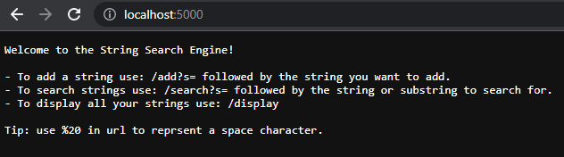
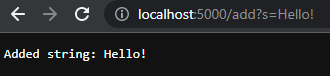
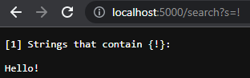
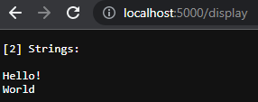
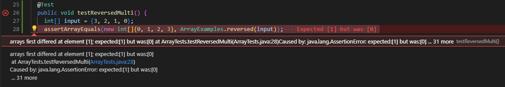
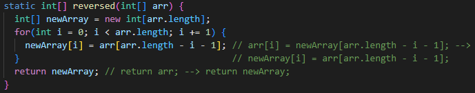
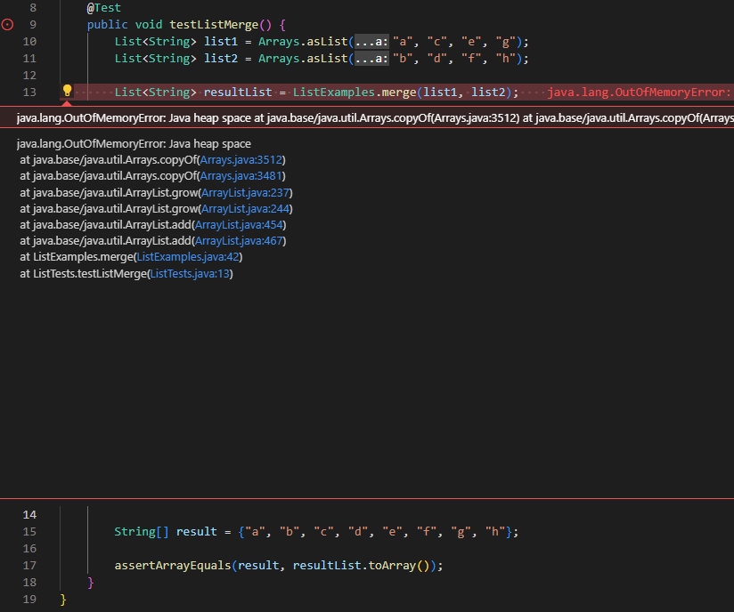
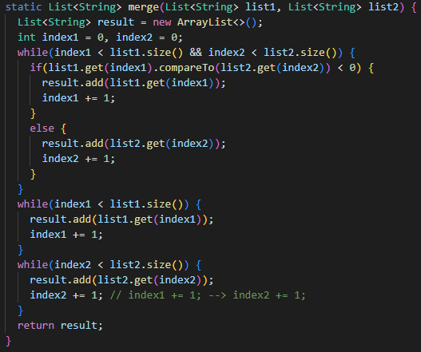

# Week 3 Lab: Search Engine and Software Bugs

<br>


## Part 1 - Search Engine:

---

<br>

**Code for SearchEngine class and handler:**

```
import java.io.IOException;
import java.net.URI;
import java.util.ArrayList;

class StringHandler implements URLHandler {

    private ArrayList<String> strings = new ArrayList<>();

    private boolean emptyString(String s) {
        return s == null || s.equals("");
    }

    private String trimStringOutput(String s, int size) {

        if (size == 0)
            return s.substring(0, s.length() - 2);
        else
            return s.substring(0, s.length() - 1);
    }

    private String addString(String s) {

        if (s != null)
            s = s.trim();

        if (emptyString(s))
            return "Cannot add an empty string.";

        if (strings.contains(s))
            return "String has already been added.";
        else {
            strings.add(s);
            return "Added string: " + s;
        }
    }

    private String getAllStringsWithSubstring(String sub) {

        int count = 0;
        String output = "";

        if (emptyString(sub))
            return "Invalid search string.";

        for (int i = 0; i < strings.size(); i++) {
            if (strings.get(i).contains(sub)) {
                output += strings.get(i) + "\n";
                count++;
            }
        }

        output = "[" + count + "] Strings that contain {" + sub + "}:\n\n" + output;

        output = trimStringOutput(output, count);

        return output;
    }

    private String display() {

        String output = "[" + strings.size() + "] Strings:\n\n";

        for (int i = 0; i < strings.size(); i++)
            output += strings.get(i) + "\n";

        output = trimStringOutput(output, strings.size());

        return output;
    }

    @Override
    public String handleRequest(URI url) {

        if (url.getPath().equals("/"))
            return "Welcome to the String Search Engine!\n\n" +
                   "- To add a string use: /add?s= followed by the string you want to add.\n" +
                   "- To search strings use: /search?s= followed by the string or substring " +
                   "to search for.\n" +
                   "- To display all your strings use: /display\n\n" +
                   "Tip: use %20 in url to reprsent a space character.";
        else if (url.getPath().equals("/display"))
            return display();
        else {
            String query = url.getQuery();

            if (query != null) {

                String[] parameters = query.split("=", 2);

                if (parameters[0].equals("s")) {

                    if (url.getPath().contains("/add"))
                        return addString(parameters[1]);

                    if (url.getPath().contains("/search"))
                        return getAllStringsWithSubstring(parameters[1]);
                }
            }
            
            return "URL not Recognized!";
        }
    }
}

public class SearchEngine {
    public static void main(String[] args) throws IOException {
        if(args.length == 0){
            System.out.println("Missing port number! Try any number between 1024 to 49151");
            return;
        }

        int port = Integer.parseInt(args[0]);

        Server.start(port, new StringHandler());
    }
}
```

<br>

**SearchEngine.java running in browser:**



When the webpage is loaded, the main method in called in `class SearchEngine` which creates a new server and initializes a new instance of `StringHandler()`. When this instance is created, an empty ArrayList of Strings is created. The server then runs the overridden `handleRequest` method for StringHandler, which displays the text illustrated in the image, because the path of the webpage is the root, i.e. `/`.

---

<br>



When adding a String to the internal ArrayList of the webpage, the user types `/add?s=` at the end of the root URL, followed by the word they want to add, in this case `Hello!`. When the enter key is pressed, the webpage is updated which begins with running the `handleRequest` method that checks if a valid URL has been entered. In this case, a vaild URL has been entered, and the URL is passed through a series of if-else statements until it is matched with the if statement checking for `/add` in the URL. At this point, a String array of the query parameters in the URL has been created, and the second parameter, which cointains the String to add, is passed to the `addString` method. When the addString method is called it makes sure the passed String is not null, empty, or already in the list. It then removes unnecessary whitespace from both side of the String if it exists, adds the string to the ArrayList, and returns the text illustrated in the image indicating the String was added. This returned message is passed to handleRequest, which returns it to be displayed on the webpage.

---

<br>



Similar to adding a String, when the user types `/search?s=` at the end of the root URL, followed by the String or substring to search for within the ArrayList, the `handleRequest` method is called. The URL makes it way to the appropriate if statement, and the second parameter of the query is passed to the `getAllStringsWithSubstring` method, which is called. This method checks the passed String against the Strings in the ArrayList, and adds the Strings in the ArrayList that contain the String to an single output String that is illustrated in the image. The method also counts the number of Strings that contain the passed String and displays that information in the square brackets of the output String.

---

<br>



If `/display` is typed at the end of the root URL, from the `handleRequest` method the `display` method is called which adds all the Strings in the ArrayList to a single output String and returns it to be printed on the webpage. Also included in the output String, like for the `search` query, is the number of Strings in the ArrayList printed in square brackets.

---

<br>

**For both the `getAllStringsWithSubstring` method and `display` method, the output String is passed to the method `trimStringOutput` which trims the end of the output String depending on if it contains zero Strings or not. Also, in the `addString` and `getAllStringsWithSubstring`, the passed String is passed to the `emptyString` method to check if the String is null or empty. Along with the `handleRequest` method, _add_ and _getString_ contain various return Strings for invalid inputs.**

---

<br><br>

## Part 2 - Software Bugs:

---

<br>

**Bug in `reversed` method in ArrayExamples.java:**



The first second element in the actual array differed from the second element in the expected array. Expected value of **1**, but got a value of **0**.

<br>



The bug in this method is illustrated in the commented text on the left side of the `-->`. The fixed code is on the right side of (or below) the `-->`.

---

<br>

**The bug in the method code caused the symptom seen in the test because the code was assigning the values in the newly created array `newArray` to the values in the passed array `arr`. Since a new int array has default values of `0`, the code was assigning the value 0 to every index in `arr`. Then the code returns `arr` as the reversed array. For the given test input, the buggy code was returning the array: `[0, 0, 0, 0]`. This is why at index 1, the test expects a `1`, but recieves a `0`.**

---

<br><br>

**Bug in `merge` method in ListExamples.java:**



While runnung the `merge` method, Java throws an `OutOfMemoryError`. The method never returns because it exhausts all the available memory.

<br>



The bug in this method is illustrated in the commented text on the left side of the `-->`. The fixed code is on the right side of the `-->`.

---

<br>

**The bug in the method code caused the symptom seen in the test because the code was entering an infinite `while` loop with no way to exit, exhusting the memory of the system. If there were still entries in `list2` after adding all the entries from `list1` to the return list, then the method would enter a while loop for `list2` that adds the rest of its entries to the return list. However, because in the while loop it was updating `index1` _not_ `index2`, the loop had no way to exit.**