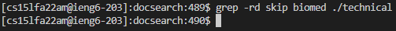
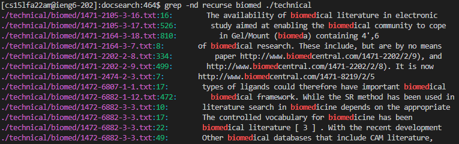
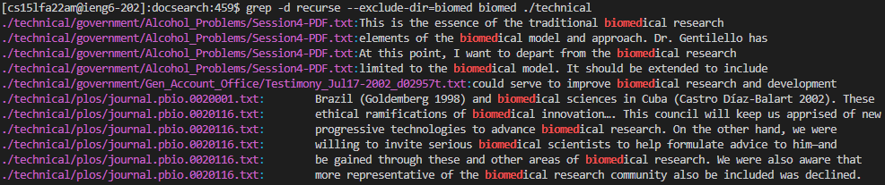
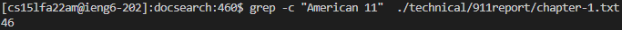
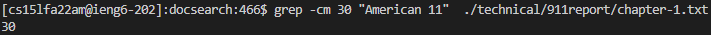
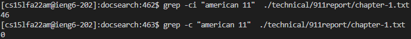
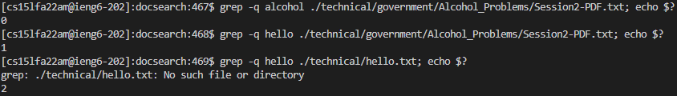
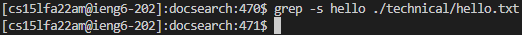
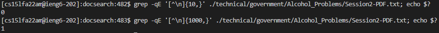

# Week 5 Lab: Researching Commands - `grep`

 

## `-d` _ACTION_, `--directories=`_ACTION_
---
### This option specifies how to process the input to `grep` if the input is a directory. _ACTION_ can be __read__, __skip__, or __recurse__. _Read_ processes a directory as though it is a file, _skip_ ignores directories, and _recurse_ reads all files within directories recursivly (this action is equivalent to the option __-r__).

 

### Example 1:

This command is using the action skip recursivly on the `/technical` directory. Since the directory only contains sub-directories, no output is produced. This option is useful for ignoring directores when searching files.

 

### Example 2:

This command is using the recursive action on the `/technical` directory, and is printing all the files that contain the string _biomed_, as well as the line in which it appears. This command also uses the `-n` action to print the line number in which the string was found. This command is useful to find all the lines in many files that contain text you are searching for.

 

### Example 3:

This command is similar to the previous example, however, it uses the `--exclude-dir=`_GLOB_ option to exclude directories from the recursive search that match the given pattern/string, in this case __biomed__. This means that the `/technical/biomed` directory is ignored, thus there is no output from files in that directory, unlike in the previous example. This command is useful for recursivley looking through directories, while ignoring particular ones.

 

## `-c`, `--count`
---
### This option overrides normal output and instead outputs the number of lines that contain the provided string/pattern for each input file.

 

### Example 1:

This command is using the plain `-c` option to count the number of lines that the string _American 11_ appears in the input file. This option is usuful to guage how many times a certain string/pattern appears in a file.

### Example 2:

This command is identical to the command from the previous example, however, it uses the option `-m` _NUM_ to stop the `grep` command after it has counted 30 lines that contain the provided string. This is why the command outputs 30, rather than 46 in the previous example. This command is useful because the user can define a minimum number of lines for a string/pattern to appear in and depending on the output, it is easy to see if the number of lines is less than or greater than the minimum value specified.

### Example 3:

This command is like the first command, but it illustrates the usefulness of the `-i` option. This option ignores the case (upper and lower) of strings/patterns to search in a file, as well as the case of the text in the input file. As illustrated in the command, it is useful for searching the number of lines that contain the given string/pattern without worrying about the case of the string/pattern.

 

## `-q`, `--quiet`, `--silent`
---
### This option tells `grep` not to output anything to standard output and to exit immediantly with a particular exit code depednding on the outcome of the command. An exit code of __0__ means at least one match was found, __1__ means no match was found, and __2__ means the command ran into an error. (Note: if a match was found _then_ the command encounters an error the `-q` option will return an exit code of 0, not 2.)

 

### Example 1:

These three commands illustrate the exit code of `grep` with the `-q` option. The command `echo $?` is used to print the exit code to the terminal. This option is useful because if the output is something you do not want, then this option eliminates it, but still gives you information about the outcome of the command in the exit code.

### Example 2:

Similar to the `-q` option, the `-s` option suppresses any error messages that `grep` creates. As opposed to the third command in the previous example, the same command with the `-s` option does not print any error message to the terminal. This option is useful because it elimates unwanted error messages from messing up the output of a bash script for example, or even the script itself.

### Example 3:

This pair of commands utilizes the `-q` option as well as an extended regular expression to check if there are any lines in the input file that are, in the first command, 10 characters or longer, and in the second command, 1000 characters or longer. The `-E` specifies the extended regular expression and the expression itself, `[^\n]{10,}`, looks for all characters but the newline character `\n`, and checks if there exists a string of them 10 characters or longer in this case. Since I do not want the actual lines from the file that match the expression, the `-q` option lets me know if the file has any lines that are 10 characters or longer, or 1000 characters or longer based on the value of the exit code. Commands like these are useful for checking for general patterns, rather than specific expressions in a file.