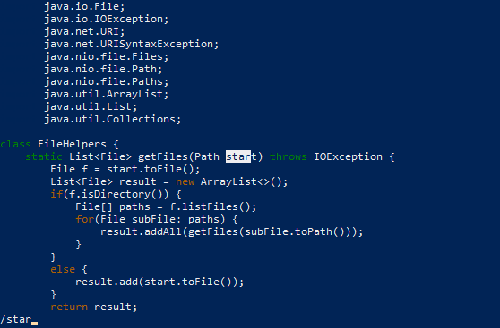

# Week 7 Lab: Vim

 

## Part 1:
---
## Task - Changing the name of the `start` parameter and its uses to `base` in `DocSearchServer.java`

 

### Sequence of key presses in Vim: `/star<Enter>cebase<Esc>n.n.:wq<Enter>` (21 keys total)

 1. `/star`

Typing `/star` after opening `DocSearchServer.java` in Vim highlights the first instance of the string in the file below the cursor, which starts at the top of the file.

 2. `<Enter>`

Pressing `<Enter>` positions the cursor on the first character of the highlighted string that `/star` found.

 3. `ce`

Typing `ce` enters __INSERT__ mode and changes (replaces) the word the cursor was on to the end of the word with nothing, hence why the word _start_ disappears.

 4. `base`

Typing `base` adds the word to the file where the word _start_ used to be.

 5. `<Esc>`

Pressing `<Esc>` exits __INSERT__ mode.

 6. `n`

Pressing `n` finds the next instance of the string _star_ from the `/star` prompt in the file, moving the cursor to the beginning of the instance.

 7. `.`

Pressing `.` repeats the last command which was `cebase`, replacing the word _start_ with the word _base_.

 8. `n.`

Repeating steps 6 and 7 by typing `n.` again replaces the next instance of the word _start_ in the file with the word _base_. Since all the instances of _start_ at this point are now _base_, we do not need to type `n.` any more times.

 9. `:wq<Enter>`

Since we have finished editing the file, typing `:wq<Enter>` saves the file and exits Vim.

 

## Part 2: Vim vs. Visual Studio Code
---

 

### To edit `DocSearchServer.java` following the task from part 1:
### - In VScode it took: __45 seconds__
### - In Vim it took: __23 seconds__ 

The only difficulty I faced was searching for the instances of the word _start_ manually in VScode in order to replace them with the word _base_.

 

If I were working on a project that I had to run remotely, I would prefer to use Vim to create and edit files because it reduces the complexity of the work by keeping everything remote. Rather than transferring files between local and remote, and having multiple instances of the terminal open, I can keep everything on the remote, making the work simpler and less prone to error. However, certain factors regarding a project could lead me to use VScode over Vim even if the project needed to be run remotely. If the project involves many files, the edits that need to be made to the files are really extensive/complex, and/or the project involes many libraries and functions, then VScode would provide me with more easily accessible information that would make working on the project much smoother than in Vim. In such circumstances, I would probably choose VScode over Vim for a project.