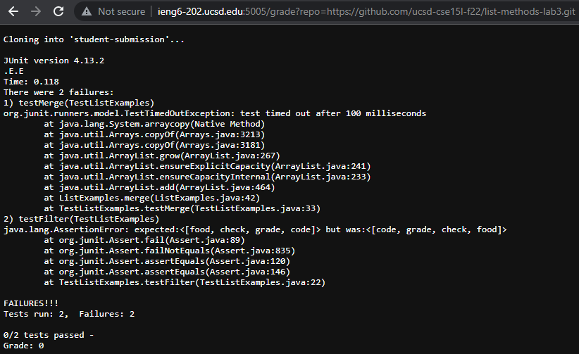
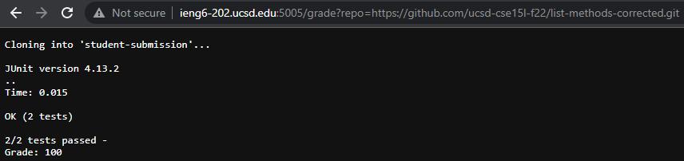
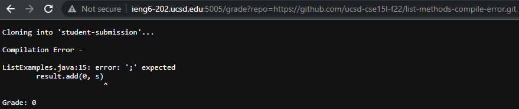

# Week 9 Lab: Grade Server

<br>

## Grading Script and Output -

### `grade.sh`
```
1   # remove existing student-submission directory from
2   # previous execution of grade.sh
3   # clone repository into student-submission directory
4   # from first command-line argument
5   rm -rf student-submission
6   git clone $1 student-submission
7
8   # instantiate variables
9   CP=".:lib/hamcrest-core-1.3.jar:lib/junit-4.13.2.jar"
10  ERRORS=0
11  TESTS=0
12  GRADE=0
13
14  # move into student-submission directory
15  cd student-submission
16
17  # check that the appropriate file exists
18  if [ ! -e ListExamples.java ]; then
19      echo $'\n'"ListExamples.java does not exist."$'\n'
20      exit 1
21  fi
22
23  # copy file from student-submisson to working directory
24  # move back to working directory
25  cp ListExamples.java ..
26  cd ..
27
28  # compile all java files and save stderr output to a text file
29  javac -cp $CP *.java 2> compilation.txt
30
31  # check that the compile command produced error output
32  # if so, prints error output and a grade of 0
33  if grep -q error compilation.txt; then
34      echo $'\n'Compilation Error -$'\n\n'"$(head -n -1 compilation.txt)"$'\n\n'Grade: $GRADE
35      exit 1
36  fi
37
38  # run the appropirate test file and save its stdout output to a text file
39  java -cp $CP org.junit.runner.JUnitCore TestListExamples > results.txt
40
41  # print the contents of the test
42  echo $'\n'"$(<results.txt)"
43
44  # calculate the number of errors, tests, and final grade
45  # sed command returns only line 2 from test output
46  ERRORS=$(sed -n 2p results.txt | grep -o 'E' | wc -l)
47  TESTS=$(sed -n 2p results.txt | grep -o '\.' | wc -l)
48  GRADE=$((100 - (100 * ($ERRORS / $TESTS))))
49
50  # calculates the number of passed tests
51  # prints out ratio
52  tests_passed=$(($ERRORS - $TESTS))
53  echo $'\n'${tests_passed#-}"/"$TESTS" tests passed -"
54
55  # prints final grade
56  echo Grade: $GRADE
```

<br>

### Output in browser from submission `https://github.com/ucsd-cse15l-f22/list-methods-lab3`:



<br>

### Output in browser from submission `https://github.com/ucsd-cse15l-f22/list-methods-corrected`:



<br>

### Output in browser from submission `https://github.com/ucsd-cse15l-f22/list-methods-compile-error`:



<br>

## Trace of `grade.sh` with the following submission: `https://github.com/ucsd-cse15l-f22/list-methods-compile-error` -

<br>

__Lines 1-4__ do not run because they are comments.

__Line 5__: `rm -rf student-submission`
* There is no stdout or stderr and the return code is 0.

__Line 6__: `git clone $1 student-submission`
* Stdout is the following: _Cloning into 'student-submission'..._
* There is no stderr and the return code is 0.

__Lines 7-8__ do not run because they are empty or comments.

__Lines 9-12__: _variable assignment_
* There is no stdout or stderr for these commands and the return code for all these comamnds is 0.

__Lines 13-14__ do not run because they are empty or comments.

__Line 15__: `cd student-submission`
* There is no stdout or stderr and the return code is 0.

__Lines 16-17__ do not run because they are empty or comments.

__Line 18__: `if [ ! -e ListExamples.java ]; then`
* This if statement evaluates to __false__ because the file `ListExamples.java` _does_ exist in the directory `student-submission`.

__Lines 19-21__ do not run as a result of the if statement on Line 18 evaluating to false.

__Lines 22-24__ do not run because they are empty or comments.

__Line 25__: `cp ListExamples.java ..`
* There is no stdout or stderr and the return code is 0.

__Line 26__: `cd ..`
* There is no stdout or stderr and the return code is 0.

__Lines 27-28__ do not run because they are empty or comments.

__Line 29__: `javac -cp $CP *.java 2> compilation.txt`
* The output for stderr is the following:<br>_ListExamples.java:15: error: ';' expected_<br>&nbsp;&nbsp;&nbsp;&nbsp;&nbsp;&nbsp;&nbsp;&nbsp;&nbsp;&nbsp;&nbsp;&nbsp;&nbsp;&nbsp;_result.add(0, s)_<br>&nbsp;&nbsp;&nbsp;&nbsp;&nbsp;&nbsp;&nbsp;&nbsp;&nbsp;&nbsp;&nbsp;&nbsp;&nbsp;&nbsp;&nbsp;&nbsp;&nbsp;&nbsp;&nbsp;&nbsp;&nbsp;&nbsp;&nbsp;&nbsp;&nbsp;&nbsp;&nbsp;&nbsp;&nbsp;&nbsp;&nbsp;&nbsp;&nbsp;&nbsp;&nbsp;&nbsp;_^_<br>_1 error_
* There is no stdout and the return code is 1.

__Lines 30-32__ do not run because they are empty or comments.

__Line 33__: `if grep -q error compilation.txt; then`
* This if statement evaluates to __true__ because `compilation.txt` contains stderr output from the command on Line 29, therefore the `grep` command returns with a code of zero, indicating the compilation has failed.

__Line 34__: `echo $'\n'Compilation Error -$'\n\n'"$(head -n -1 compilation.txt)"$'\n\n'Grade: $GRADE`
*  The output for stdout is the following:<br><br>_Compilation Error -_<br><br>_ListExamples.java:15: error: ';' expected_<br>&nbsp;&nbsp;&nbsp;&nbsp;&nbsp;&nbsp;&nbsp;&nbsp;&nbsp;&nbsp;&nbsp;&nbsp;&nbsp;&nbsp;_result.add(0, s)_<br>&nbsp;&nbsp;&nbsp;&nbsp;&nbsp;&nbsp;&nbsp;&nbsp;&nbsp;&nbsp;&nbsp;&nbsp;&nbsp;&nbsp;&nbsp;&nbsp;&nbsp;&nbsp;&nbsp;&nbsp;&nbsp;&nbsp;&nbsp;&nbsp;&nbsp;&nbsp;&nbsp;&nbsp;&nbsp;&nbsp;&nbsp;&nbsp;&nbsp;&nbsp;&nbsp;&nbsp;_^_<br><br>_Grade: 0_
* There is no stderr and the return code is 0.

__Line 35__: `exit 1`
* There is no stdout or stderr and the return code is 1, as it exits `grade.sh` with that return code.

__Lines 36-56__ do not run because `grade.sh` terminates and returns an code of 1 on Line 35.